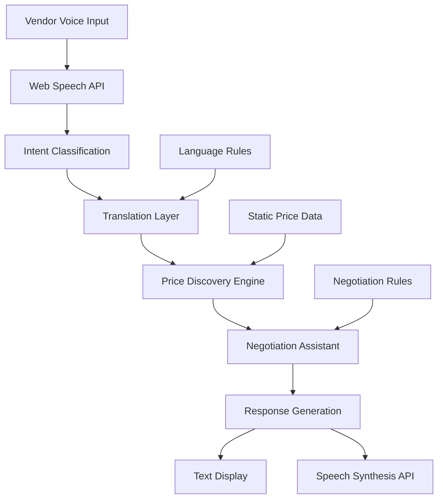

# Design Document

## Overview

The Real-Time Linguistic Bridge is a voice-first web application that provides multilingual negotiation assistance for local vendors. The system follows a deterministic-first approach with minimal AI usage, optimized for one-day implementation and real-time performance on low-end devices.

The architecture prioritizes browser-native APIs, stateless operation, and clear separation between deterministic logic (preferred) and AI-assisted components (limited use). The system operates entirely in the frontend with no backend servers, databases, or persistent storage.

## Architecture

### System Flow



### Component Architecture

**Frontend Layer (HTML/CSS/JavaScript)**
- Single-page application with minimal UI
- Large microphone button for voice input
- Language selector (Hindi, Kannada, English)
- Response display panel
- Mobile-first responsive design

**Speech Processing Layer**
- Web Speech API for speech-to-text conversion
- Browser Speech Synthesis API for text-to-speech output
- Language detection and validation
- Audio feedback for user interaction

**Understanding Layer (Minimal AI)**
- Intent classification (bargaining, bulk purchase, inquiry)
- Context-aware translation preserving negotiation tone
- Single-turn LLM prompts for language processing
- Fallback to deterministic rules when AI fails

**Business Logic Layer (Deterministic)**
- Rule-based price discovery using static JSON datasets
- Negotiation range calculations based on product categories
- Bulk discount logic with predefined thresholds
- Cultural context rules for appropriate responses

**Data Layer (Static)**
- JSON files with product categories and price ranges
- Language phrase templates for common negotiations
- Cultural context rules for different regions
- No persistent storage or user data retention

## Components and Interfaces

### VoiceInterface Component
**Responsibilities:**
- Capture voice input using Web Speech API
- Provide visual feedback during recording
- Handle speech recognition errors and retries
- Support multiple languages (Hindi, Kannada, English)

**Interface:**
```javascript
class VoiceInterface {
  startListening(language)
  stopListening()
  onSpeechResult(callback)
  onError(callback)
}
```

### IntentClassifier Component
**Responsibilities:**
- Analyze speech text to determine user intent
- Classify into: bargaining, bulk_purchase, casual_inquiry
- Use deterministic keyword matching with AI fallback
- Operate on single-turn inputs only without relying on prior interaction state

**Interface:**
```javascript
class IntentClassifier {
  classifyIntent(text, language)
  getConfidenceScore()
  extractKeywords(text)
}
```

### TranslationEngine Component
**Responsibilities:**
- Translate between Hindi, Kannada, and English
- Preserve negotiation tone and intent awareness
- Use AI for nuanced translation with rule-based fallbacks
- Handle common trade phrases with predefined translations

**Interface:**
```javascript
class TranslationEngine {
  translate(text, fromLanguage, toLanguage)
  preserveNegotiationTone(text, intent)
  getCommonPhrases(language, category)
}
```

### PriceDiscoveryEngine Component
**Responsibilities:**
- Provide fair price suggestions based on static datasets
- Calculate negotiation ranges for different product categories
- Apply bulk discount rules based on quantity
- Return price confidence levels and market context

**Interface:**
```javascript
class PriceDiscoveryEngine {
  getMarketPrice(product, category)
  calculateNegotiationRange(basePrice, intent)
  applyBulkDiscount(price, quantity)
  getPriceConfidence(product)
}
```

### NegotiationAssistant Component
**Responsibilities:**
- Generate counter-offer suggestions based on customer intent
- Provide culturally appropriate negotiation guidance
- Suggest value-added propositions for price-sensitive customers
- Determine when to accept, counter, or decline offers

**Interface:**
```javascript
class NegotiationAssistant {
  generateCounterOffer(customerOffer, marketPrice, intent)
  getNegotiationGuidance(situation, culturalRules)
  suggestValueAdditions(product, intent)
  evaluateOfferAgainstRules(offer, minPrice)
}
```

### ResponseGenerator Component
**Responsibilities:**
- Format AI and rule-based responses for display
- Generate text-to-speech output in vendor's preferred language
- Ensure responses are culturally appropriate and actionable
- Provide fallback responses when AI processing fails

**Interface:**
```javascript
class ResponseGenerator {
  formatResponse(data, language, intent)
  generateSpeech(text, language)
  createFallbackResponse(error, context)
  validateCulturalAppropriateness(response, region)
}
```

## Data Models

### VoiceInput Model
```javascript
{
  text: string,
  language: 'hindi' | 'kannada' | 'english',
  confidence: number,
  timestamp: Date,
  duration: number
}
```

### Intent Model
```javascript
{
  type: 'bargaining' | 'bulk_purchase' | 'casual_inquiry',
  confidence: number,
  keywords: string[],
  context: object,
  product: string,
  quantity: number
}
```

### PriceData Model
```javascript
{
  product: string,
  category: string,
  marketPrice: number,
  minPrice: number,
  maxPrice: number,
  bulkThreshold: number,
  bulkDiscount: number
}
```

### NegotiationResponse Model
```javascript
{
  suggestion: string,
  reasoning: string,
  counterOffer: number,
  acceptanceRange: [number, number],
  culturalNotes: string,
  confidence: number
}
```

### SystemResponse Model
```javascript
{
  text: string,
  language: string,
  audioUrl: string,
  actionable: boolean,
  fallback: boolean,
  timestamp: Date
}
```

## Correctness Properties

*A property is a characteristic or behavior that should hold true across all valid executions of a system—essentially, a formal statement about what the system should do. Properties serve as the bridge between human-readable specifications and machine-verifiable correctness guarantees.*

Based on the prework analysis, the following properties capture the core testable behaviors:

**Property 1: Voice-to-Intent Processing Pipeline**
*For any* valid voice input in supported languages (Hindi, Kannada, English), the system should successfully convert speech to text, extract intent, and trigger appropriate processing without requiring additional user actions.
**Validates: Requirements 1.2, 1.3, 1.4, 2.1, 2.2**

**Property 2: Intent Classification Accuracy**
*For any* vendor speech input, the system should correctly classify the intent as bargaining, bulk purchase, or casual inquiry, and detect relevant patterns in customer responses.
**Validates: Requirements 3.1, 3.3**

**Property 3: Single-Turn Consistency**
*For any* valid voice input, the system should generate responses based solely on the most recent utterance without relying on prior interaction history.
**Validates: Requirements 3.4**

**Property 4: Clarification Behavior**
*For any* ambiguous input where intent cannot be determined with confidence, the system should ask appropriate clarifying questions.
**Validates: Requirements 3.5**

**Property 5: Price Discovery Completeness**
*For any* price inquiry, the system should provide comprehensive price suggestions including market context, negotiation ranges, bulk discounts when applicable, and fallback strategies when data is unavailable.
**Validates: Requirements 4.1, 4.2, 4.3, 4.4, 4.5**

**Property 6: Negotiation Assistance Comprehensiveness**
*For any* customer offer or negotiation scenario, the system should provide appropriate guidance including counter-offers, tactics, value propositions, acceptance recommendations, and compromise solutions.
**Validates: Requirements 5.1, 5.2, 5.3, 5.4, 5.5**

**Property 7: Response Language Consistency**
*For any* system-generated response, the output should be displayed in the vendor's preferred language with optional TTS support when available.
**Validates: Requirements 6.1, 6.2**

**Property 8: Response Prioritization**
*For any* scenario with multiple response options, the system should present them in order of relevance and practicality.
**Validates: Requirements 6.5**

**Property 9: Privacy Protection**
*For any* system operation, no personal data, conversations, or audio recordings should be stored, and no PII should be transmitted to external services.
**Validates: Requirements 7.1, 7.2, 7.4**

**Property 10: Error Handling Robustness**
*For any* system error (speech recognition failure, AI processing error, network issues, compatibility problems), the system should provide clear feedback and appropriate recovery options.
**Validates: Requirements 2.4, 8.3, 10.1, 10.2, 10.3, 10.4**

**Property 11: Cultural Sensitivity**
*For any* negotiation guidance or price suggestion, the system should consider local trading customs and default to respectful, neutral guidance when cultural context is uncertain.
**Validates: Requirements 9.1, 9.3, 9.5**

**Property 12: Accessibility Feedback**
*For any* user action or system state change, appropriate visual and audio feedback should be provided to accommodate varying technical literacy levels.
**Validates: Requirements 8.5**

<function_calls>
<invoke name="prework">
<parameter name="featureName">real-time-linguistic-bridge
## Error Handling

### Speech Recognition Errors
- **Failure Detection**: Monitor Web Speech API error events and confidence scores
- **User Feedback**: Display clear visual indicators when speech recognition fails
- **Retry Mechanism**: Provide simple retry button with instructions
- **Fallback Options**: Suggest optimal browser settings or alternative input methods

### AI Processing Errors
- **Timeout Handling**: Set 3-second timeout for AI responses with fallback to deterministic rules
- **Service Unavailability**: Cache common responses and provide rule-based alternatives
- **Invalid Responses**: Validate AI outputs and use predefined templates when invalid
- **Graceful Degradation**: Continue operation with reduced functionality rather than complete failure

### Network Connectivity Issues
- **Connection Detection**: Monitor online/offline status using navigator.onLine
- **Offline Mode**: Provide limited deterministic guidance when AI services are unavailable, without storing data locally
- **User Notification**: Clear messaging about connectivity status and limitations
- **Progressive Enhancement**: Core functionality works without external dependencies

### Browser Compatibility Issues
- **Feature Detection**: Check for Web Speech API and Speech Synthesis support
- **Polyfill Strategy**: Provide text-only fallbacks when speech APIs unavailable
- **User Guidance**: Display browser-specific instructions for optimal experience
- **Graceful Fallback**: Maintain core functionality across different browser capabilities

## Testing Strategy

Property-based tests are defined as a design-level correctness strategy; full implementation is outside the one-day MVP scope.

### Dual Testing Approach

The system requires both unit testing and property-based testing for comprehensive coverage:

**Unit Tests** focus on:
- Specific examples of voice input processing
- Edge cases in price calculation logic
- Error conditions and recovery mechanisms
- Integration points between components
- Browser API interaction validation

**Property-Based Tests** focus on:
- Universal properties that hold across all valid inputs
- Comprehensive input coverage through randomization
- Correctness properties defined in this design document
- Minimum 100 iterations per property test for statistical confidence

### Property-Based Testing Configuration

**Testing Library**: Use fast-check for JavaScript property-based testing
**Test Configuration**: Minimum 100 iterations per property test
**Tagging Format**: Each test tagged with **Feature: real-time-linguistic-bridge, Property {number}: {property_text}**

**Example Property Test Structure**:
```javascript
// Feature: real-time-linguistic-bridge, Property 1: Voice-to-Intent Processing Pipeline
fc.assert(fc.property(
  fc.record({
    text: fc.string(),
    language: fc.constantFrom('hindi', 'kannada', 'english'),
    confidence: fc.float(0.5, 1.0)
  }),
  (voiceInput) => {
    const result = processVoiceInput(voiceInput);
    return result.intent !== null && result.processed === true;
  }
), { numRuns: 100 });
```

### Testing Balance

- **Property tests handle comprehensive input coverage** - testing universal behaviors across many generated inputs
- **Unit tests handle specific scenarios** - testing concrete examples, integration points, and error conditions
- **Both approaches are complementary** - property tests verify general correctness while unit tests catch specific bugs

### Test Coverage Requirements

Each correctness property must be implemented by a single property-based test that:
1. References the specific design document property number
2. Tests the universal behavior described in the property
3. Runs minimum 100 iterations with randomized inputs
4. Validates the expected outcome for all valid inputs
5. Includes appropriate input generators for the domain

Unit tests should complement property tests by covering:
- Specific examples that demonstrate correct behavior
- Edge cases that are difficult to generate randomly
- Error conditions and boundary cases
- Integration between different system components